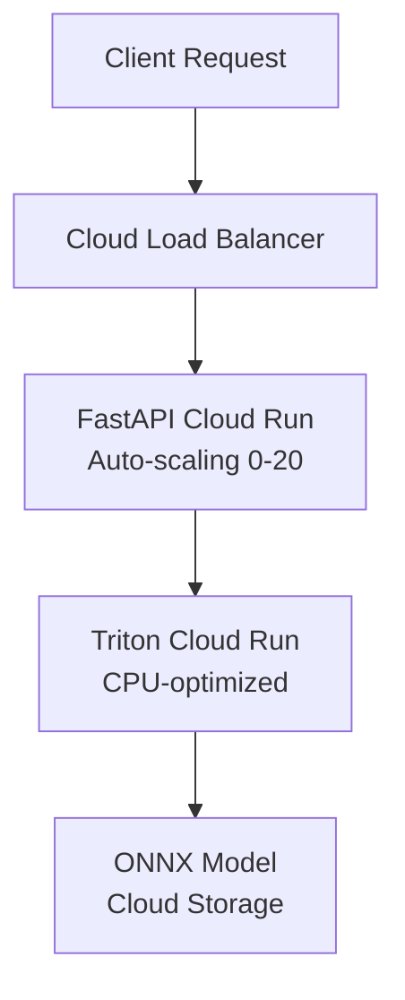
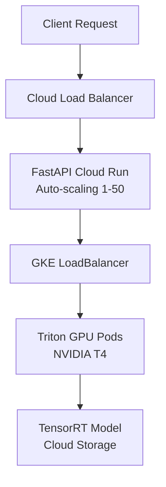

# 🚀 GPU vs CPU Deployment Comparison

Choose the right deployment option for your image recognition API based on your performance requirements and budget.

## 📊 Quick Comparison

| Feature | CPU Deployment | GPU Deployment |
|---------|----------------|----------------|
| **Cost** | ~$15-50/month | ~$150-500/month |
| **Performance** | 20-50 RPS | 100-300 RPS |
| **Latency** | 50-150ms | 15-50ms |
| **Infrastructure** | Cloud Run | GKE + Cloud Run |
| **Scaling** | Scale to zero | Min 1 instance |
| **Setup Time** | 15-20 minutes | 25-35 minutes |
| **Best For** | Moderate workloads | High-volume production |

## 🖥️ CPU Deployment

### ✅ **Advantages**
- **Lower Cost**: Significantly cheaper (~70% less)
- **Scale to Zero**: No idle costs when not in use
- **Simpler Infrastructure**: Only Cloud Run services
- **Faster Setup**: Quicker deployment process
- **Auto-scaling**: Seamless scaling from 0 to 20+ instances

### ❌ **Limitations**
- **Slower Inference**: 2-5x slower than GPU
- **Lower Throughput**: Limited to moderate traffic
- **CPU Bottleneck**: May struggle with large batches

### 🎯 **Best For**
- Development and testing environments
- Small to medium applications (<50 RPS)
- Cost-sensitive deployments
- Irregular traffic patterns
- Proof of concepts

### 💰 **Cost Breakdown**
```
Monthly Costs (Moderate Usage):
- Cloud Run API:     $10-20
- Cloud Run Triton:  $15-25
- Cloud Storage:     $1-3
- Cloud Scheduler:   $0.10
- Total:            ~$26-48/month
```

## 🔥 GPU Deployment

### ✅ **Advantages**
- **High Performance**: 3-5x faster inference
- **Better Throughput**: Handle 100+ concurrent requests
- **Optimized Models**: TensorRT optimizations
- **Consistent Latency**: More predictable response times
- **Production Ready**: Built for high-volume workloads

### ❌ **Limitations**
- **Higher Cost**: 5-10x more expensive
- **Complex Setup**: GKE cluster + GPU nodes
- **No Scale to Zero**: Always running instances
- **Longer Deployment**: More complex infrastructure

### 🎯 **Best For**
- Production environments
- High-traffic applications (>100 RPS)
- Real-time applications requiring low latency
- Batch processing workloads
- Commercial applications

### 💰 **Cost Breakdown**
```
Monthly Costs (High Usage):
- GKE GPU Nodes:     $200-400
- Cloud Run API:     $20-40
- Cloud Storage:     $2-5
- Load Balancer:     $18
- Cloud Scheduler:   $0.10
- Total:            ~$240-463/month
```

## ⚡ Performance Comparison

### Inference Speed
```
Single Image Processing:
CPU: 50-150ms per image
GPU: 15-50ms per image
Speedup: 3-5x faster with GPU

Batch Processing (16 images):
CPU: 800-1200ms per batch
GPU: 200-400ms per batch  
Speedup: 4-6x faster with GPU
```

### Throughput
```
Concurrent Requests:
CPU: 20-50 RPS sustained
GPU: 100-300 RPS sustained
Scalability: 5-10x higher with GPU

Peak Performance:
CPU: ~80 RPS (burst)
GPU: ~500 RPS (burst)
```

## 🏗️ Architecture Differences

### CPU Architecture


### GPU Architecture  


## 🚀 Deployment Commands

### CPU Deployment
```bash
# Set environment variables
export PROJECT_ID=your-gcp-project-id
export DEPLOYMENT_TYPE=cpu

# Deploy
./deploy_to_gcp.sh deploy

# Test
curl -X POST "https://your-api-url/detect" \
  -H "Content-Type: multipart/form-data" \
  -F "file=@test-image.jpg"
```

### GPU Deployment
```bash
# Set environment variables
export PROJECT_ID=your-gcp-project-id
export DEPLOYMENT_TYPE=gpu

# Deploy (requires GKE setup)
./deploy_to_gcp.sh deploy

# Test
curl -X POST "https://your-api-url/detect" \
  -H "Content-Type: multipart/form-data" \
  -F "file=@test-image.jpg"
```

## 📈 Scaling Characteristics

### CPU Scaling
- **Cold Start**: 2-5 seconds
- **Scale to Zero**: Yes (cost savings)
- **Max Instances**: 20 per service
- **Auto-scaling**: Based on CPU/memory usage
- **Traffic Spikes**: Good handling up to 5x normal load

### GPU Scaling
- **Cold Start**: 10-30 seconds (GKE pod startup)
- **Scale to Zero**: No (always 1+ instances)
- **Max Instances**: Limited by GPU quota
- **Auto-scaling**: Based on GPU utilization
- **Traffic Spikes**: Excellent handling up to 10x normal load

## 🎯 Decision Matrix

Choose **CPU** if you have:
- [ ] Budget constraints (<$50/month)
- [ ] Irregular traffic patterns
- [ ] Development/testing environment
- [ ] Low to moderate traffic (<50 RPS)
- [ ] Tolerance for higher latency (>100ms)

Choose **GPU** if you have:
- [ ] Production workload requirements
- [ ] High traffic volume (>100 RPS)
- [ ] Low latency requirements (<50ms)
- [ ] Budget for premium performance ($200+/month)
- [ ] Consistent traffic patterns

## 🔄 Migration Path

### CPU to GPU Migration
```bash
# 1. Deploy GPU version alongside CPU
export DEPLOYMENT_TYPE=gpu
./deploy_to_gcp.sh deploy

# 2. Test GPU deployment
python scripts/test_api.py --url https://gpu-api-url

# 3. Switch traffic gradually
# Update DNS or load balancer configuration

# 4. Clean up CPU deployment
export DEPLOYMENT_TYPE=cpu
./deploy_to_gcp.sh cleanup
```

### GPU to CPU Downgrade
```bash
# 1. Deploy CPU version
export DEPLOYMENT_TYPE=cpu
./deploy_to_gcp.sh deploy

# 2. Validate performance meets requirements
python scripts/test_api.py --performance 100 --url https://cpu-api-url

# 3. Switch traffic
# Update DNS or load balancer

# 4. Clean up GPU deployment
export DEPLOYMENT_TYPE=gpu
./deploy_to_gcp.sh cleanup
```

## 📊 Monitoring Differences

### CPU Monitoring
```bash
# Cloud Run metrics
gcloud run services describe image-recognition-api-cpu-$HASH \
  --region=us-central1

# View logs
gcloud logging read "resource.type=cloud_run_revision" \
  --filter="resource.labels.service_name=image-recognition-api-cpu"
```

### GPU Monitoring
```bash
# GKE cluster status
kubectl get nodes
kubectl describe nodes

# GPU utilization
kubectl top nodes
kubectl logs -l app=triton-server-gpu

# Cloud Run API status
gcloud run services describe image-recognition-api-gpu-$HASH \
  --region=us-central1
```

## 🛠️ Troubleshooting

### CPU Common Issues
1. **Cold starts**: Increase min-instances to 1
2. **Memory errors**: Increase memory allocation
3. **Timeout errors**: Increase request timeout
4. **Scale issues**: Check concurrency settings

### GPU Common Issues
1. **GPU quota**: Request GPU quota increase
2. **Pod startup**: Check NVIDIA driver installation
3. **Out of memory**: Reduce batch size or increase GPU memory
4. **Cluster issues**: Verify GKE cluster health

## 💡 Optimization Tips

### CPU Optimization
- Use smaller batch sizes (8-16)
- Enable CPU-specific ONNX optimizations
- Implement request caching
- Optimize image preprocessing

### GPU Optimization  
- Use larger batch sizes (16-32)
- Enable TensorRT optimizations
- Use FP16 precision
- Implement model warming

## 📚 Next Steps

1. **Start with CPU** for development and testing
2. **Benchmark your workload** to understand requirements
3. **Consider GPU** for production high-volume deployments
4. **Monitor costs and performance** regularly
5. **Scale appropriately** based on actual usage patterns

---

**Need help deciding?** Run both deployments and compare performance with your actual workload using the provided testing scripts. 